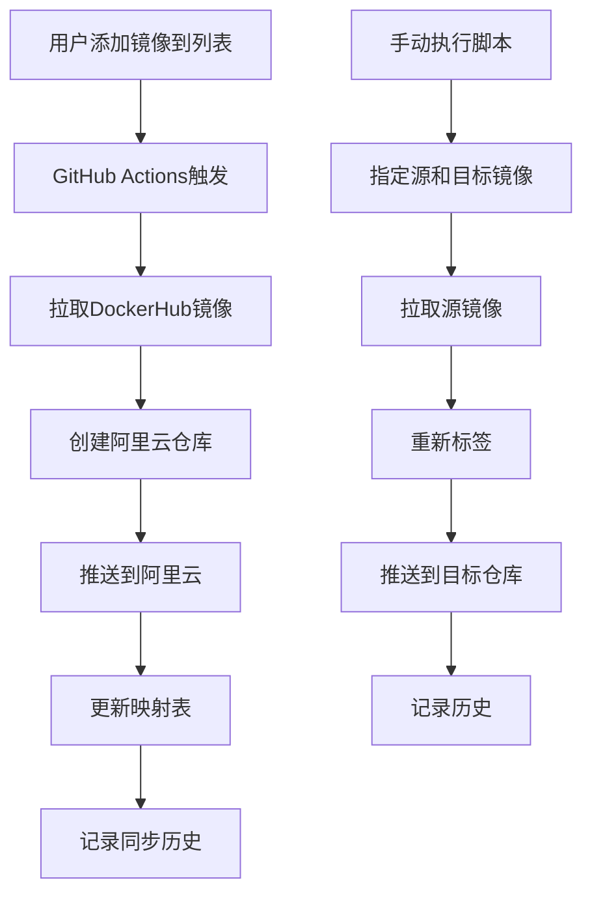

# Docker镜像同步系统产品需求文档

## 1. Product Overview

Docker镜像同步系统是一个自动化工具，用于将DockerHub上的镜像同步到阿里云容器镜像服务中，解决国内访问DockerHub速度慢的问题。
- 主要解决Docker镜像拉取速度慢、网络不稳定的问题，为国内用户提供高速的镜像访问服务。
- 目标用户包括开发者、运维工程师和需要频繁使用Docker镜像的团队，帮助提升开发效率和部署速度。

## 2. Core Features

### 2.1 Feature Module

我们的Docker镜像同步系统包含以下主要功能模块：
1. **手动同步页面**: 命令行脚本执行，支持单个镜像的手动同步操作。
2. **自动同步页面**: GitHub Actions工作流，支持批量镜像的自动化同步。
3. **镜像管理页面**: 镜像列表管理，同步历史记录和状态跟踪。

### 2.2 Page Details

| Page Name | Module Name | Feature description |
|-----------|-------------|---------------------|
| 手动同步页面 | 命令行脚本 | 执行transfer.sh脚本，指定源镜像和目标镜像地址，完成单个镜像的拉取、标签和推送操作 |
| 自动同步页面 | GitHub Actions工作流 | 监听upload/images.md文件变更，自动批量处理镜像列表，创建阿里云仓库并同步镜像 |
| 镜像管理页面 | 镜像列表管理 | 维护待同步镜像列表，记录同步历史，生成镜像映射表，跟踪处理状态 |

## 3. Core Process

**手动同步流程：**
用户通过命令行执行transfer.sh脚本，指定源镜像和目标镜像地址，系统自动完成镜像拉取、重新标签和推送到阿里云的全过程，并记录同步历史。

**自动同步流程：**
用户在upload/images.md文件中添加需要同步的镜像列表，提交到GitHub后触发Actions工作流，系统自动批量处理所有镜像，创建对应的阿里云仓库，完成同步并更新映射表。

## 4. User Interface Design

### 4.1 Design Style

- 主色调：深蓝色(#1f2937)和绿色(#10b981)，体现技术专业性
- 按钮样式：圆角矩形，带有悬停效果
- 字体：等宽字体用于代码和命令显示，无衬线字体用于界面文本
- 布局风格：命令行界面风格，简洁的表格布局
- 图标风格：使用Docker和云服务相关的简洁线性图标

### 4.2 Page Design Overview

| Page Name | Module Name | UI Elements |
|-----------|-------------|-------------|
| 手动同步页面 | 命令行界面 | 黑色背景终端风格，绿色成功提示，红色错误提示，黄色警告信息 |
| 自动同步页面 | GitHub Actions界面 | GitHub原生界面风格，工作流状态指示器，日志输出区域 |
| 镜像管理页面 | 表格展示 | Markdown表格格式，清晰的列分隔，状态标识图标 |

### 4.3 Responsiveness

系统主要面向开发者使用，采用桌面优先设计，命令行工具无需响应式适配，GitHub Actions界面继承GitHub平台的响应式特性。