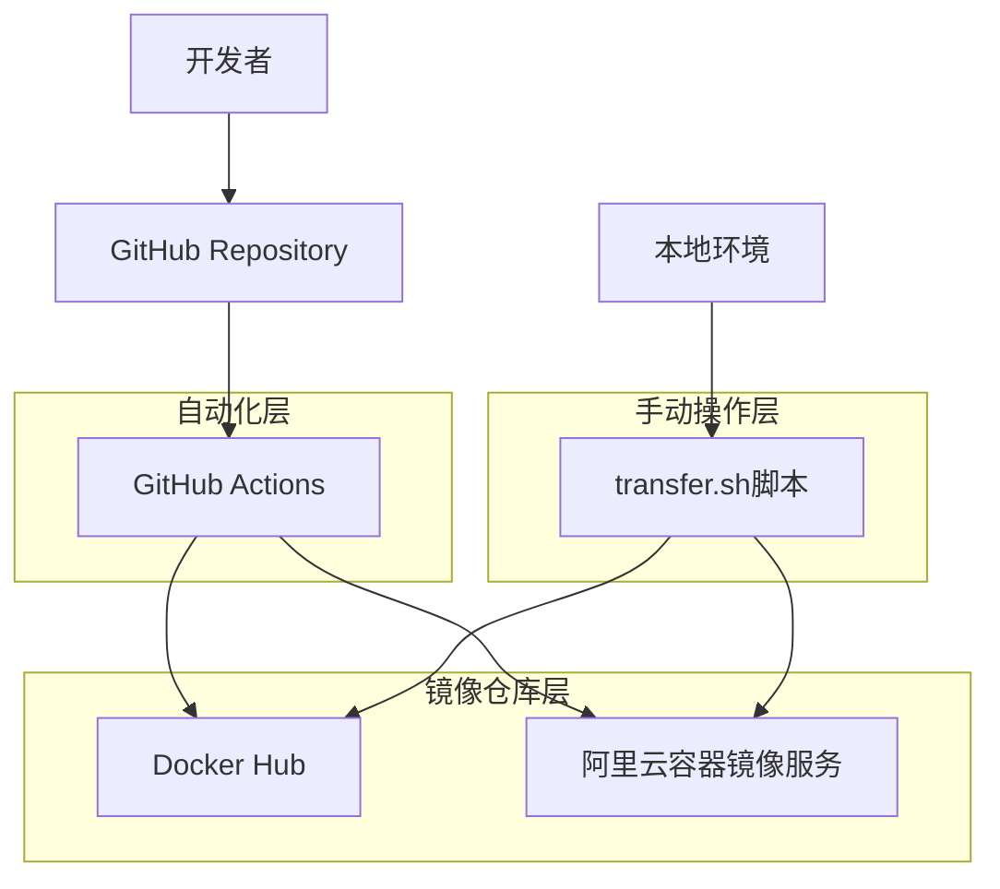
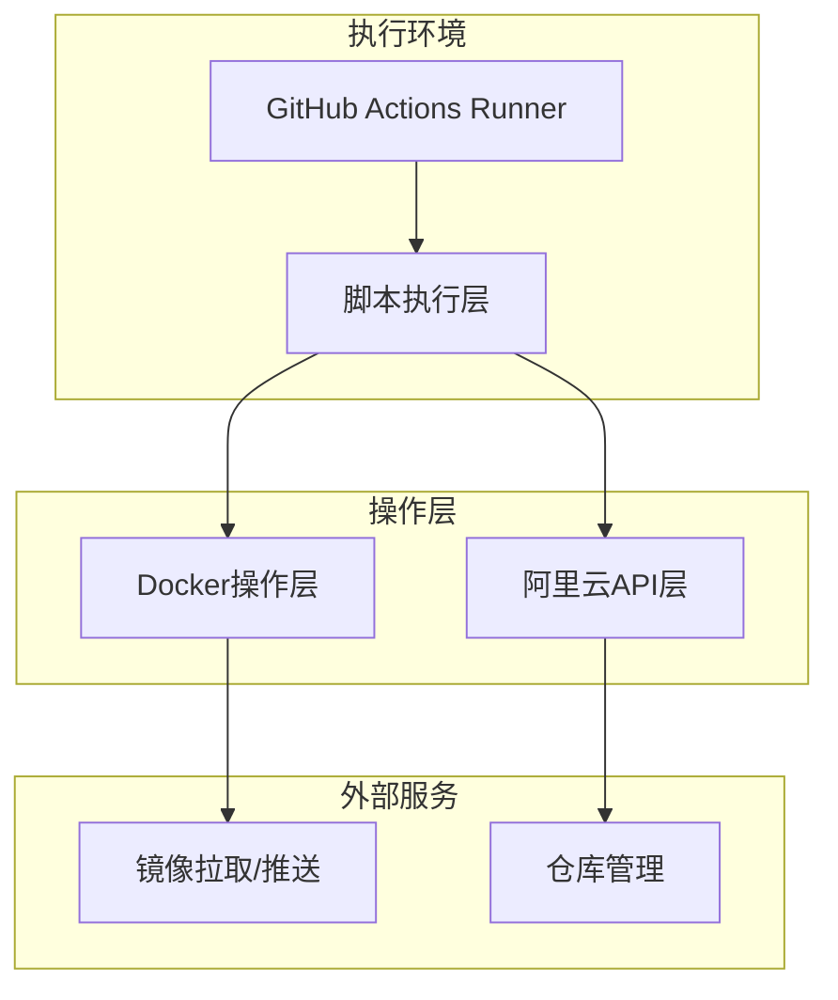
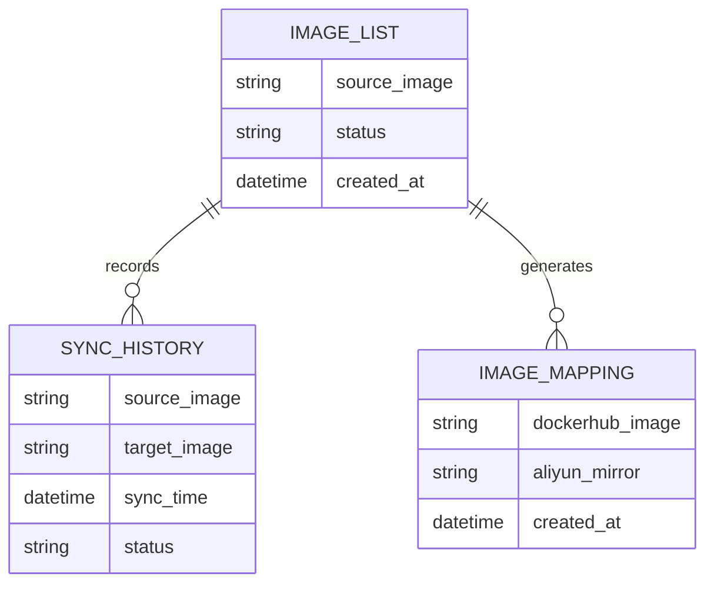

# Docker镜像同步系统技术架构文档

## 1. Architecture design



## 2. Technology Description

- 前端：无（命令行工具）
- 后端：Bash脚本 + GitHub Actions
- 工具：Docker CLI, 阿里云CLI, Git
- 平台：GitHub Actions (Ubuntu Latest)

## 3. Route definitions

| Route | Purpose |
|-------|---------|
| /upload/images.md | 镜像列表文件，触发自动同步流程 |
| /transfer.sh | 手动同步脚本，执行单个镜像同步 |
| /transfer_history.md | 同步历史记录文件 |
| /.github/workflows/sync-images.yml | GitHub Actions工作流配置 |

## 4. API definitions

### 4.1 Core API

**Docker Hub API**
```
GET https://registry-1.docker.io/v2/{namespace}/{repository}/manifests/{tag}
```

请求参数：
| Param Name | Param Type | isRequired | Description |
|------------|------------|------------|-------------|
| namespace | string | true | Docker Hub命名空间 |
| repository | string | true | 仓库名称 |
| tag | string | true | 镜像标签 |

**阿里云容器镜像服务API**
```
POST https://cr.{region}.aliyuncs.com/
```

请求参数：
| Param Name | Param Type | isRequired | Description |
|------------|------------|------------|-------------|
| Action | string | true | API操作类型（CreateRepository/GetRepository） |
| RepoName | string | true | 仓库名称 |
| RepoNamespace | string | true | 命名空间 |
| RepoType | string | false | 仓库类型（PUBLIC/PRIVATE） |

响应示例：
```json
{
  "RequestId": "xxx-xxx-xxx",
  "Code": "200",
  "IsSuccess": true
}
```

## 5. Server architecture diagram



## 6. Data model

### 6.1 Data model definition



### 6.2 Data Definition Language

**镜像列表文件 (upload/images.md)**
```markdown
# 待同步镜像列表
krytro/aiaw
nginx:latest
redis:alpine
```

**同步历史文件 (transfer_history.md)**
```markdown
| 源镜像 | 目标镜像 | 运行时间 |
|---|---|---|
| nginx:latest | registry.cn-hangzhou.aliyuncs.com/namespace/nginx:latest | 2024-01-01 12:00:00 |
```

**镜像映射文件 (image_list.md)**
```markdown
# Docker Image Mapping
| DockerHub Image | Aliyun Mirror |
|-----------------|---------------|
| `nginx:latest` | `registry.cn-hangzhou.aliyuncs.com/namespace/nginx:latest` |
```

**GitHub Actions环境变量配置**
```yaml
# 必需的Secrets配置
ALIYUN_REGION: cn-hangzhou
ALIYUN_ACCESS_KEY_ID: your_access_key_id
ALIYUN_ACCESS_KEY_SECRET: your_access_key_secret
ALIYUN_REGISTRY: registry.cn-hangzhou.aliyuncs.com
ALIYUN_USERNAME: your_aliyun_username
ALIYUN_PASSWORD: your_aliyun_password
ALIYUN_NAMESPACE: your_namespace
DOCKERHUB_USERNAME: your_dockerhub_username
DOCKERHUB_TOKEN: your_dockerhub_token
```